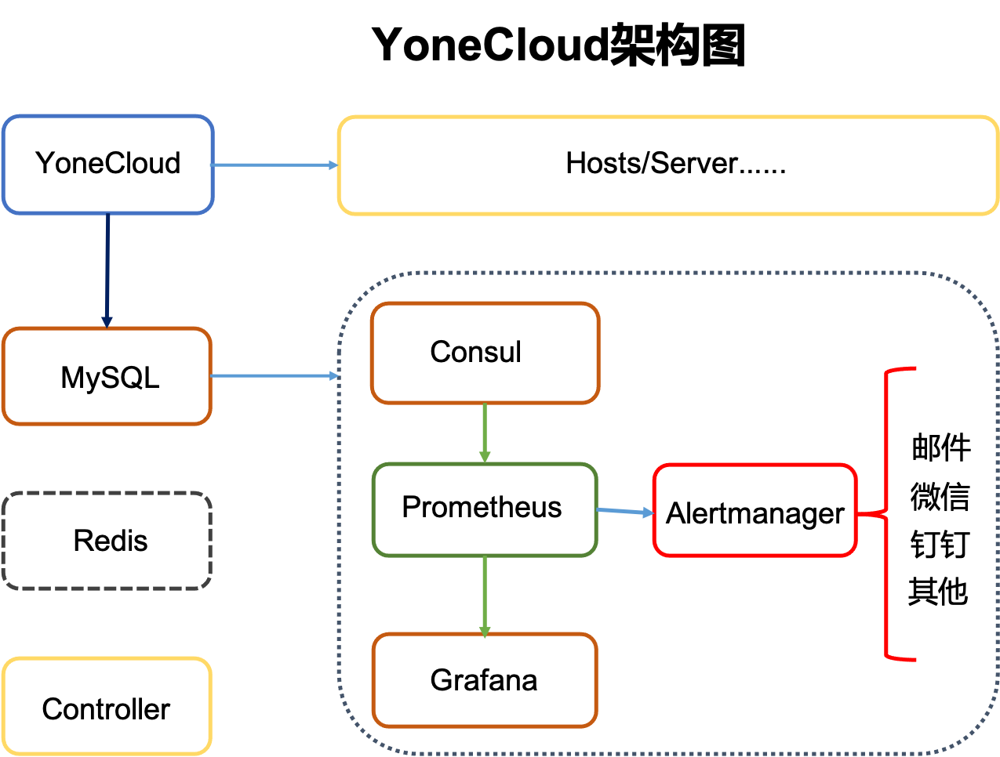
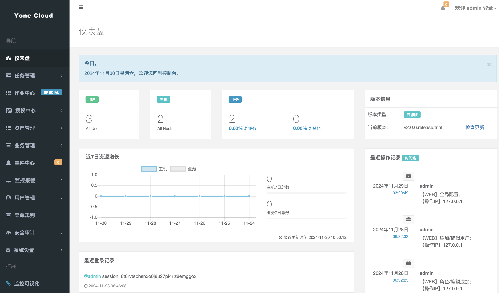
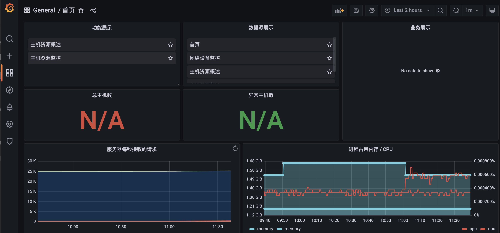

<h1 align="center">YoneCloud</h1>
<div style="margin-bottom:16px;font-size:15px">一站式运维监控管理平台；资产管理提供基本数据源，整合Prometheus、Alertmanager、Grafana组成监控系统，并提供批量命令、定时任务、WebTerminal等功能，便于二次开发与集成。</div>

## 架构
  

## 功能

- **任务管理**: `定时任务；单次 与 周期 执行，相当于定时的作业中心`
- **作业中心**: `可对主机批量执行命令并记录`
- **用户管理**: `平台登录的用户；含角色、权限，资产授权等`
- **资产管理**: `主机、网络设备等资源`
- **监控报警**: `监控、报警规则、组件、通知渠道等配置`
- **业务管理**: `对业务进行管理及关联到资产`
- **日志审计**: `对用户在平台各种操作的记录`
- **系统设置**: `系统方面的配置，如：名称、Logo、禁止IP、登录白名单等`

## 环境

* Python 3.8.x
* MySQL 5.7.x
* JavaScript

## 部署
### 1、docker-compose 部署
#### 须提前安装好docker（engine >= 19.x）与 docker-compose（>=2.x）
```bash
wget https://github.com/yunling101/yoneCloud/releases/download/v0.1.0/docker-compose-deploy.zip
unzip docker-compose-deploy.zip
cd deploy

# 编辑配置 .env 环境文件，并部署集群。
vim .env 
./setup.sh deploy
./setup.sh ps
```

### 2、kubernetes 部署
```bash
helm repo add yone https://yunling101.github.io/charts
helm repo update

# 安装
helm install myapp yone/yonecloud

# 卸载
helm uninstall myapp
```

## 截图





## License
项目基于 Apache 协议，详细请参考 [LICENSE](LICENSE)
